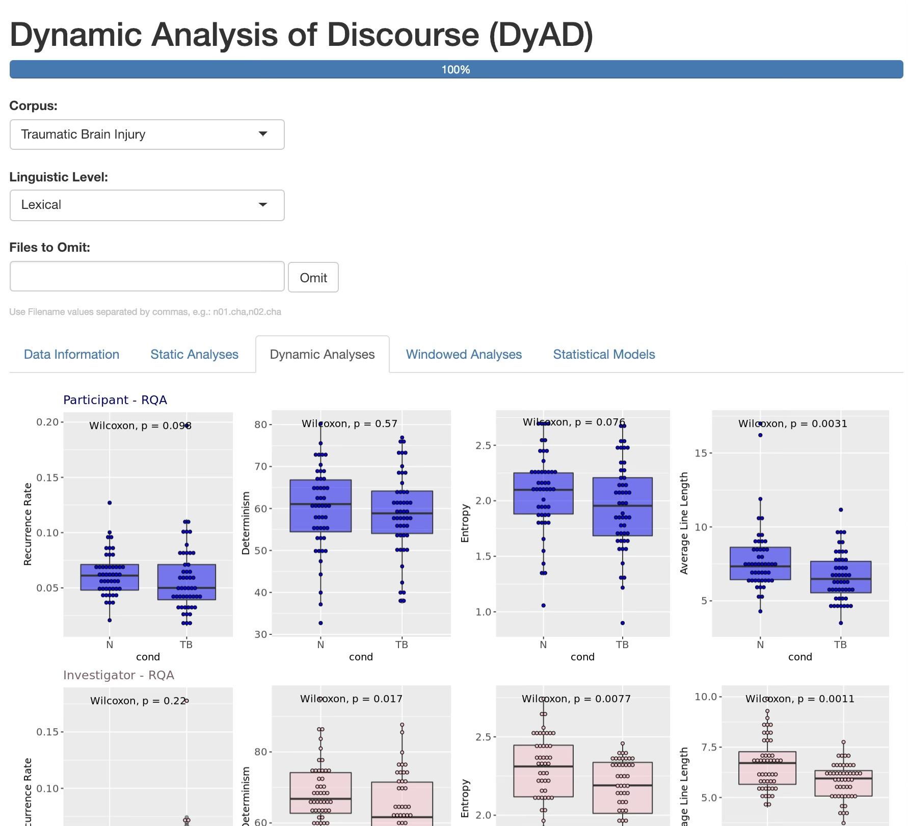

# bode-akinboye-et-al
DyAD data processing and analysis pipeline for CRQA analysis in Bode-Akinboye, Rietdijk, Dale, & Turkstra (under review).

The research used "Dynamic Analysis of Discourse" (DyAD) point-and-click interface to view transcripts, check analysis, etc. The core components of this workflow are a set of processing and analysis functions in R. These are included here, and reflect the "under the hood" processing in DyAD.

*Note*: DyAD contains partial analysis for semantic and syntactic annotations of transripts as well. These are included as illustrations in the interface, though they remain under development. The primary analysis in the paper is at the lexical level which is the most complete part of the DyAD interface.

*Command-line version*: The interested researcher can also consult `cli_analysis.R`. The first and third authors worked together to check DyAD's output and develop a script that can conduct analysis without the need to install the full DyAD interface for the lexical approach described in the paper.

Illustration of DyAD:

